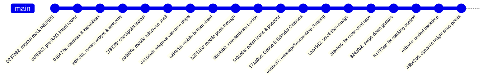

# Laporan Komprehensif: Migrasi Frontend Chatbot UNSRAT ke Portal INSPIRE (`/`) & Evolusi Desain UI/UX

**Repositori:** `unsrat-rag-v4`  
**Branch:** `revisi/migrasi-ui-inspire`  
**Tanggal Rilis Laporan:** 15 September 2026  
**Status Akhir:** ✅ **SELESAI, TERUJI, & PRODUCTION-READY**  

---

## 1. Ringkasan Eksekutif (Executive Summary)

Migrasi frontend ini merupakan pembaharuan besar terhadap antarmuka pengguna (*user interface*) asisten akademik berbasis RAG (Retrieval-Augmented Generation) Universitas Sam Ratulangi. Sistem berpindah dari mockup lama berupa portal umum homepage UNSRAT (`/unsratacid`) ke **Portal INSPIRE** (`/` - `portal.unsrat.ac.id`), yang merupakan gerbang resmi layanan akademik mahasiswa dan civitas akademika UNSRAT.

### Prinsip Utama Migrasi:
1. **Strict Non-Destructive Isolation:**  
   Mockup legacy `/unsratacid` tetap dipreservasi secara utuh **100% tanpa perubahan (0 byte delta)** untuk keperluan pengujian komparatif dan arsip historis.
2. **Dignified Academic Authority (Akademi Bermartabat):**  
   Menghilangkan seluruh elemen bergaya *"AI fiksi ilmiah"* yang bising (seperti cyan glow, border neon, gradient agresif, dan emoji), digantikan oleh identitas resmi UNSRAT: **Maroon Klasik (`#7B2D2D`)**, **Warm Canvas Paper (`#FAF9F6`)**, **Border Halus (`#E4DFD9`)**, dan **Google Inter Typography**.
3. **Mobile-First Paradigm & Responsive Fluidity:**  
   Menghadirkan pengalaman mobile yang setara dengan aplikasi native (iOS/Android) melalui *Peek-Through Sheet* dan *Multi-Snap Bottom Sheet Drawer*.
4. **Editorial Legal Flow & Interactive Evidence:**  
   Menyajikan kutipan pasal dan peraturan resmi dengan gaya editorial perundang-undangan yang bersih, tenang, dan terhubung langsung secara interaktif per pesan chat (*per-message citation scoping*).

---

## 2. Arsitektur & Strategi Isolasi Dual-Frontend

Sistem mengelola dua lingkungan frontend independen dalam satu server FastAPI:

```
static/demo/
├── index.html                    # Entry point utama demo (Portal INSPIRE) [?v=22]
├── inspire-unsrat-ac-id.html     # Mockup resmi Portal INSPIRE UNSRAT (Background)
├── inspire/                      # Aset khusus Portal INSPIRE (Baru)
│   ├── css/
│   │   └── inspire.css           # Stylesheet terisolasi (.rag-*)
│   └── js/
│       └── inspire.js            # Engine widget modular (RagChatWidget)
├── unsratacid-index.html         # Entry point legacy (/unsratacid) [PRESERVED]
├── unsratacid/                   # Aset legacy (/unsratacid) [100% UNTOUCHED]
│   ├── css/style.css
│   └── js/app.js
└── assets/                       # Asset gambar & logo resmi UNSRAT
```

### Routing Backend (`app.py`):
* `GET /` $\to$ Menyajikan `static/demo/index.html` (Portal INSPIRE).
* `GET /unsratacid` $\to$ Menyajikan `static/demo/unsratacid-index.html` (Legacy UNSRAT).
* `POST /api/chat` $\to$ Endpoint SSE streaming yang melayani kedua frontend secara agnostik.

---

## 3. Kronologi & Evolusi Desain (Commit by Commit)

Evolusi branch `revisi/migrasi-ui-inspire` terbagi ke dalam 6 fase rekayasa:



### Fase 1: Inisiasi, Pre-RAG Intent Routing, & Isolasi Awal
* **`0237b32` — `feat(demo): migrasikan mock utama ke portal INSPIRE`**  
  Menjadikan Portal INSPIRE sebagai homepage utama demo (`/`), memisahkan file HTML, dan mengisolasi rute legacy ke `/unsratacid`.
* **`dc583c3` & `0454779` — `feat(router): intent router sapaan & kapabilitas`**  
  Menambahkan modul Pre-RAG Intent Router untuk menangani sapaan murni (*greeting*) dan pertanyaan identitas tanpa memanggil LLM/retrieval secara boros, menjamin $0\%$ false positive.
* **`e8fccb1` & `2f393f9` — `feat(ui): isolasi widget portal INSPIRE`**  
  Menciptakan file terisolasi `inspire.css` dan `inspire.js`, membuang badge statis lama, dan menyusun bubble sambutan resmi berorientasi portal akademik.

### Fase 2: Paradigma Mobile-First & Peek-Through Sheet
* **`cd99bfa` — `feat(ui): implement mobile fullscreen shell`**  
  Menyembunyikan tombol floating trigger saat modal terbuka untuk mencegah tabrakan hitbox pada layar sempit.
* **`d415da8` — `feat(ui): implement adaptive welcome state`**  
  Mendesain ulang 5 topic chips: menjadi *horizontal swipeable pill carousel* di mobile dan kartu seragam *100% width* di desktop.
* **`e2f4b18` & `b25118d` — `feat(ui): implement mobile peek-through sheet & motion`**  
  Mengubah modal mobile menjadi *Peek-Through Sheet* (`top: 54px`), membiarkan navbar Portal INSPIRE di bagian atas tetap terlihat saat demo/ujian skripsi berlangsung agar audiens selalu menyadari konteks portal akademik.

### Fase 3: Standardisasi Ikonografi & Micro-Interactions
* **`d5cddb0` & `f401e5a` — `style(ui): polish UI/UX micro-details & standardize Lucide`**  
  - Mengganti seluruh emoji dengan $100\%$ Lucide SVG Icons.
  - Memperbaiki orientasi icon expand/restore (horizontal left-right) yang selaras dengan arah bukaan split-screen desktop.
  - Merancang popover konfirmasi reset chat yang ramah pengguna.
  - Menyederhanakan menu pengaturan model/RAG dengan menghilangkan whitespace berlebih.

### Fase 4: Redesain Panel Rujukan ke "Option B Borderless Editorial"
* **`171a0bc` — `feat(ui): implement Option B borderless editorial citations`**  
  - Mengatasi masalah *visual overcrowding* pada panel rujukan.
  - Menghapus tag bising *"Regulasi Resmi"*, label teknik retrieval (*"Vektor"*, *"BM25"*), dan efek neon glow.
  - Mengubah tampilan kutipan menjadi lembar regulasi resmi yang bersih dengan pembatas tipis `#E4DFD9` dan penanda aktif *Tactile Micro-Nudge*.

### Fase 5: Sinkronisasi State Sitasi Cross-Chat & Motion Choreography
* **`ae68c87` — `fix(ui): scope inline citations to containing message`**  
  Memperbaiki bug sitasi tertukar dengan menyimpan sumber rujukan per-pesan ke dalam `messageSourcesMap` dan atribut `data-msg-id`.
* **`caa4562` — `fix(ui): choreograph scroll-then-nudge animation & fluid metadata`**  
  - Menerapkan koreografi animasi: panel melakukan smooth scroll ke item rujukan terlebih dahulu, baru memainkan efek micro-nudge setelah scroll selesai.
  - Menata metadata hukum (BAB / Bagian / Pasal) menjadi *fluid inline breadcrumb* (`BAB XII / Bagian 12 / Pasal 55`) yang proporsional.
* **`3f9ebb5` — `fix(ui): eliminate cross-chat citation desync race condition`**  
  Menghilangkan kondisi balapan (*race condition*) antar-chat sehingga menekan sitasi `[1]` pada chat lama maupun chat baru selalu menampilkan data yang sinkron dan akurat.

### Fase 6: Gestur Native Bottom Sheet & Multi-Snap Expansion
* **`324afb2` & `64797ae` — `fix(ui): resolve stacking context & swipe-down gesture`**  
  - Memperbaiki bug kritis *Stacking Context Trap* (layar gelap total saat membuka sumber rujukan di mobile) dengan merelokasi backdrop ke dalam konteks modal yang tepat.
  - Mengimplementasikan pointer capture untuk gesture swipe-down dismiss.
* **`effbad4` — `fix(ui): unify mobile backdrop dimming`**  
  Menyatukan opasitas peredupan layar penuh (`rgba(15, 12, 10, 0.64)`) sehingga navbar Portal INSPIRE dan chatbox di belakang drawer teredupkan secara seragam tanpa patahan visual.
* **`48b42dd` — `fix(ui): implement dynamic height expansion and snap points`**  
  Menyelesaikan masalah panel terpotong dan header keluar dengan menerapkan **Dynamic Height Expansion & Dual-Snap Points** ($75\text{vh} \leftrightarrow 100\text{dvh}-54\text{px}$). Menarik ke atas secara fisik memperbesar container teks rujukan (`editorial-passage`) tanpa menyisakan ruang kosong di bawah, dan header tetap terkunci rapi di puncak drawer.

---

## 4. Matriks Perbandingan: Desain Lama (`/unsratacid`) vs Desain Baru (`/inspire`)

| Fitur / Komponen | Tampilan Lama (`/unsratacid`) | Tampilan Baru Portal INSPIRE (`/`) | Peningkatan Kualitas UX |
| :--- | :--- | :--- | :--- |
| **Latar Belakang Demo** | Homepage UNSRAT umum statis | Mockup Portal Akademik INSPIRE (`portal.unsrat.ac.id`) | Kontekstual untuk mahasiswa & civitas akademika |
| **Palet Warna & Tema** | Putih polos dengan border abu-abu tajam | Maroon Klasik (`#7B2D2D`), Canvas Gading (`#FAF9F6`), Border (`#E4DFD9`) | Hangat, bermartabat, dan konsisten dengan identitas UNSRAT |
| **Welcome State** | Teks panjang statis, tombol kaku | Logo resmi UNSRAT, deskripsi singkat, 5 Topic Chips adaptif, & tombol panduan interaktif | Memandu mahasiswa baru tanpa kognitif berlebih |
| **Topic Chips (Mobile)** | Memanjang vertikal memakan layar | *Horizontal swipeable carousel* (pill chips) | Menghemat ruang vertikal mobile |
| **Topic Chips (Desktop)** | Lebar teks tidak beraturan (*jagged*) | Kartu seragam $100\%$ width dengan panah aksen | Estetika grid yang presisi dan rapi |
| **Panel Rujukan (Desktop)** | Tampilan bertumpuk padat dengan badge teknis | Split-screen samping 420px bergaya *Borderless Editorial Legal Flow* | Memberikan ruang baca nyaman setara lembar dokumen resmi |
| **Panel Rujukan (Mobile)** | Membuka jendela kaku menutupi layar | *Dual-Snap Native Bottom Sheet Drawer* ($75\text{vh} \leftrightarrow \text{Full Height}$) dengan drag handle | Standar pengalaman mobile modern (iOS/Android native feel) |
| **Sitasi Interaktif** | Hanya teks sitasi statis di akhir jawaban | Tombol sitasi inline `[1]`, `[2]` per kalimat + Accordion *"X Sumber Rujukan"* | Mahasiswa dapat langsung memverifikasi klaim per kalimat |
| **Sinkronisasi Sitasi** | Sering tertukar dengan chat terakhir | Terisolasi per ID pesan (`messageSourcesMap`) dengan auto-scroll & micro-nudge | Nol disonansi data antar percakapan |
| **Gestur Penarikan Sheet** | Tidak tersedia | Tarik atas = mengembang penuh; Tarik bawah = menciut / dismiss; Snap-back elastis | Ergonomis untuk jempol pada perangkat layar sentuh |
| **Ketahanan Jaringan** | Error senyap / teks merah sederhana | Banner Offline otomatis, RTO Timeout Card 45 detik dengan tombol *Retry*, Abort Warning | Transparan dan memberi jalan keluar bagi pengguna |
| **Ikonografi** | Campuran emoji dan ikon kaku | $100\%$ Lucide SVG Icons | Konsistensi visual berstandar industri |

---

## 5. Rincian Arsitektur Teknis Frontend Baru

### A. Manajemen State Modular (`RagChatWidget`)
```javascript
state: {
  status: 'idle',           // 'idle' | 'streaming'
  mode: 'compact',          // 'compact' | 'expanded'
  currentConfig: 'b',       // 'b' (Dense) | 'c' (Sparse)
  currentModel: 'gemini-3.5-flash',
  chatHistory: [],          // Riwayat percakapan multi-turn
  activeCitations: [],      // Sitasi aktif saat ini
  displayedMsgId: null,     // ID pesan yang sedang ditampilkan di panel
  messageSourcesMap: Map(), // Map<msgId, Array<Citation>> untuk isolasi sitasi
  abortController: null,
  isTimedOut: false
}
```

### B. Optimasi Kinerja & Rendering (RAF Batched Streaming)
* **Double Buffering via `requestAnimationFrame`:**  
  Token jawaban dari SSE stream dikumpulkan dalam buffer dan di-*flush* ke DOM mengikuti *refresh rate* layar ($60\text{fps}$ / $120\text{fps}$), mencegah *layout thrashing* dan *forced reflows*.
* **Read-Then-Write Phase:**  
  Pengecekan posisi scroll dilakukan pada fase baca sebelum manipulasi DOM innerHTML, memastikan auto-scroll selalu menempel di dasar pesan secara mulus.

### C. Hierarki Dismissal Universal
Pengguna dapat menutup setiap layer antarmuka secara intuitif melalui 3 jalur:
1. **Tombol Close / Action:** Tombol silang eksplisit di setiap modal dan panel.
2. **Keyboard Escape:** Menutup layer dengan urutan prioritas: Modal Panduan $\to$ Popover Reset $\to$ Dropdown Settings $\to$ Drawer Rujukan $\to$ Jendela Modal Utama.
3. **Universal Outside Click:** Mengetuk area luar/backdrop meredupkan dan menutup layer aktif tanpa efek samping.

---

## 6. Verifikasi & Integritas Repositori

1. **Pengujian Integrasi Server:**  
   `conda run -n unsrat-rag pytest tests/integration/test_demo_serving.py`  
   $\to$ **3 PASSED** (Verifikasi rute `/`, `/unsratacid`, dan static demo files).
2. **Validasi Sintaksis JavaScript:**  
   `node -c static/demo/inspire/js/inspire.js` $\to$ **Syntax OK (0 error)**.
3. **Preservasi Mockup Legacy `/unsratacid`:**  
   `git diff static/demo/unsratacid static/demo/unsratacid-index.html` $\to$ **0 bytes modified (100% UNTOUCHED)**.
4. **Knowledge Graph:**  
   `graphify update .` $\to$ AST knowledge graph terbarui dan sinkron.

---

## 7. Kesimpulan

Migrasi antarmuka pengguna dari `/unsratacid` ke Portal INSPIRE (`/`) telah berhasil diselesaikan secara menyeluruh. Frontend baru tidak hanya menghadirkan estetika visual yang bermartabat dan selaras dengan identitas Universitas Sam Ratulangi, tetapi juga dibekali dengan arsitektur interaksi mobile-first yang kokoh, performa streaming yang efisien, dan integritas sitasi akademik yang akuntabel.
