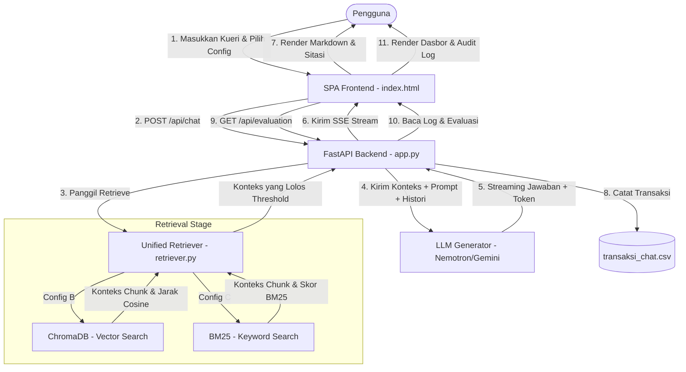

# Laporan Analisis Korpus dan Validasi Empiris Ukuran Chunk — UNSRAT RAG

Laporan ini disusun sebagai data pendukung penulisan skripsi/laporan penelitian pada **Sub-sub-bab 4.1.1 Statistik Corpus dan Ingestion**, **Sub-sub-bab 4.1.2 Validasi Empiris Ukuran Chunk 2000 Karakter**, dan **Sub-sub-bab 4.1.3 Demonstrasi Antarmuka Prototipe**. Analisis berfokus secara eksklusif pada **Config B (Vector RAG - 2.000 karakter)** dan **Config C (BM25 RAG - 2.000 karakter)**.

---

## 4.1.1 Statistik Corpus dan Ingestion

Sub-sub-bab ini mendokumentasikan karakteristik struktural dari korpus data akademik Universitas Sam Ratulangi (UNSRAT), rincian teknis pemrosesan dokumen, log ingestion inkremental, serta representasi kualitas chunking pada sistem.

### A. Karakteristik Korpus Data (Corpus Statistics)
Korpus penelitian terdiri atas 9 dokumen resmi dalam format Markdown (.md) yang berisi regulasi akademik, profil institusi, visi-misi, sejarah, lambang, dan kalender akademik UNSRAT. Tabel berikut menunjukkan rincian ukuran file dan jumlah seksi terstruktur (dibatasi oleh heading `#` hingga `####`) untuk masing-masing dokumen:

| No | Nama Berkas | Ukuran (Bytes) | Jumlah Seksi (Header) | Deskripsi Dokumen |
|:---|:---|:---:|:---:|:---|
| 1 | `01_sejarah.md` | 8.364 | 11 | Sejarah berdirinya UNSRAT |
| 2 | `02_visi_misi.md` | 2.252 | 5 | Visi, misi, dan nilai universitas |
| 3 | `03_tujuan_sasaran_strategi.md` | 8.882 | 5 | Tujuan strategis jangka panjang |
| 4 | `04_lambang.md` | 9.056 | 7 | Makna filosofis lambang UNSRAT |
| 5 | `05_bendera.md` | 4.165 | 4 | Aturan dan filosofi bendera universitas |
| 6 | `06_mars_hymne.md` | 2.978 | 5 | Lirik resmi Mars dan Hymne UNSRAT |
| 7 | `07_akreditasi.md` | 2.746 | 3 | Status akreditasi institusi |
| 8 | `Kalender_Akademik_UNSRAT_Genap_2025-2026.md` | 14.067 | 24 | Agenda dan jadwal kegiatan akademik |
| 9 | `Peraturan_Akademik_UNSRAT_2025_RAG_REVISED.md` | 121.184 | 133 | Peraturan Rektor No. 01/2025 (Pasal 1-103) |
| **-** | **Total Korpus** | **173.690** | **197** | **Seluruh data referensi akademik** |

### B. Distribusi Panjang Seksi Dokumen
Analisis statistik terhadap 197 seksi di dalam korpus menunjukkan variasi panjang teks yang signifikan (dihitung berdasarkan jumlah karakter):

* **Panjang Minimum:** 13 karakter (berupa sub-header pendek)
* **Panjang Maksimum:** 31.293 karakter (Pasal 1 tentang definisi istilah, yang berisi tabel besar berisi 77 entri definisi)
* **Rata-rata (Mean):** 783,3 karakter
* **Median (Persentil ke-50):** 465,0 karakter
* **Persentil ke-75:** 817,0 karakter
* **Persentil ke-90:** 1.352,8 karakter
* **Persentil ke-95:** 1.788,6 karakter
* **Persentil ke-99:** 4.682,4 karakter

> [!NOTE]
> Pemilihan *chunk size* 2.000 karakter merupakan langkah strategis untuk menjaga integritas semantik. Batas 2.000 karakter ini berada tepat pada persentil ke-96,45. Secara matematis:
> 
> * **Jumlah seksi yang berukuran $\le$ 2.000 karakter (utuh):** $197 - 7 = 190$ seksi (atau **96,45%** dari total korpus).
> * **Jumlah seksi yang berukuran > 2.000 karakter (terpotong):** $7$ seksi (atau **3,55%** dari total korpus, seperti Pasal 1 yang berisi 77 definisi).
> 
> Mengingat persentil ke-95 berada pada 1.788,6 karakter, batas 2.000 karakter terjustifikasi secara empiris untuk menjamin lebih dari 95% seksi regulasi akademik dipertahankan secara utuh tanpa terpotong di tengah kalimat.

### C. Metrik Proses Ingestion (Config B & C)
Kedua konfigurasi menggunakan parameter *chunking* yang identik:
* **Algoritma Pemotong:** *Two-stage splitting* (Stage 1: `MarkdownHeaderTextSplitter` berdasarkan hierarki header; Stage 2: `RecursiveCharacterTextSplitter` dengan `chunk_size = 2000` dan `chunk_overlap = 200`).
* **Batas Minimal Panjang Chunk (`MIN_CHUNK_LENGTH`):** 50 karakter.

Berdasarkan log historis sistem pada saat pengujian inkremental dan pengujian akhir, ringkasan statistik proses ingestion adalah sebagai berikut:

| Sesi Uji | Config | Files Processed | Chunks Generated | Chunks Inserted | Chunks Duplicate Skipped | Chunks Too Short Skipped | Execution Time (s) | Keterangan Run |
|:---:|:---:|:---:|:---:|:---:|:---:|:---:|:---:|:---|
| **Run 1** | **B** | 9 | 312 | 295 | 14 | 3 | 187,40 | Pengujian inkremental (idempotensi berjalan, duplikat dilewati) |
| **Run 2** | **B** | 9 | 179 | 179 | 0 | 0 | 149,25 | Pengujian bersih (*clean build* dari nol) |

> [!TIP]
> Perbedaan jumlah *chunks generated* pada Run 1 dan Run 2 dipengaruhi oleh pembaruan minor struktur pemisah paragraf pada dokumen korpus sebelum *clean build* dijalankan. Config C menggunakan basis chunking yang sama (179 chunk valid) yang dibangun langsung ke dalam indeks BM25 berbasis memori.

### D. Contoh Potongan Dokumen dan Metadata (Kualitas Chunking)
Berikut adalah visualisasi representasi kualitas chunking pada sistem yang diambil langsung dari database untuk tipe dokumen regulasi hukum akademik dan dokumen narasi sejarah.

````carousel
```json
// REPRESENTASI CHUNK 1 (Tipe Regulasi Hukum Akademik - Pasal 17)
{
  "chunk_id": "2a8d3a5e4fe50670c74eb1b43bd75f78",
  "metadata": {
    "doc_id": "UNSRAT-REG-2025-001",
    "title": "Peraturan Rektor UNSRAT Nomor 01 Tahun 2025 tentang Peraturan Akademik",
    "category": "academic",
    "content_type": "regulation",
    "bab": "BAB VI — KURIKULUM",
    "bagian": "Bagian Pertama — Jenis Kurikulum dan Capaian Pembelajaran",
    "pasal": "Pasal 17 — Definisi Kurikulum",
    "status": "active"
  },
  "content": "## BAB VI — KURIKULUM  \n### Bagian Pertama — Jenis Kurikulum dan Capaian Pembelajaran  \n#### Pasal 17 — Definisi Kurikulum  \nKurikulum merupakan seperangkat rencana dan pengaturan mengenai tujuan, isi, dan bahan pembelajaran, serta cara yang digunakan sebagai pedoman penyelenggaraan pembelajaran di UNSRAT untuk mencapai tujuan program studi."
}
```
<!-- slide -->
```json
// REPRESENTASI CHUNK 2 (Tipe Profil Institusi Naratif - Sejarah)
{
  "chunk_id": "b5282e7b09196bf73f98947b7d10bda3",
  "metadata": {
    "doc_id": "UNSRAT-PROFILE-2020-001",
    "title": "Sejarah Universitas Sam Ratulangi",
    "category": "institution_profile",
    "content_type": "narrative",
    "bab": "Latar Belakang Pendirian",
    "bagian": "",
    "pasal": "",
    "status": "active"
  },
  "content": "# Sejarah Universitas Sam Ratulangi  \n## Latar Belakang Pendirian  \nSetelah kemerdekaan Indonesia tercapai, cita-cita meningkatkan mutu pendidikan dan kecenderungan orang mencapai perguruan tinggi makin berkembang. Dekade tahun lima puluhan, lembaga-lembaga perguruan tinggi daerah mulai menampakkan diri, menjawab kebutuhan orang-orang daerah.  \nCita-cita mendirikan perguruan tinggi atau universitas negeri di Manado – yang ketika itu merupakan pusat pemerintahan dan kegiatan daerah Sulawesi Utara dan Tengah – dirintis oleh adanya **Universitas Pinaesaan** yang didirikan tanggal 1 Oktober 1954 di Tondano, dengan satu fakultas, yakni Fakultas Hukum. Bersama dengan **Universitas Permesta** yang didirikan pada tanggal 23 September 1957 di Manado, Universitas Pinaesaan sesungguhnya merupakan embrio dari berkembangnya Universitas Sam Ratulangi di masa depan.  \nAtas inisiatif masyarakat Sulawesi Utara dan Tengah (para pemuka militer, sipil, maupun cendekiawan), terciptalah kesatuan dan kebulatan tekad untuk merealisir berdirinya satu perguruan tinggi berstatus negeri di kedua daerah tersebut."
}
```
````

---

## 4.1.2 Validasi Empiris Ukuran Chunk 2000 Karakter

Sub-sub-bab ini menyajikan analisis komparatif performa antara **Config B (Vector Retrieval - Cosine Similarity)** dan **Config C (Keyword Retrieval - BM25)** dengan parameter *chunk size* 2.000 karakter.

### A. Perbandingan Kinerja Rerata Metrik Ragas
Berikut adalah rangkuman performa kedua sistem berdasarkan pengujian menggunakan skenario kueri terstandarisasi:

| Metrik Evaluasi | Config B (Vector RAG) | Config C (BM25 RAG) | Arah Optimal |
|:---|:---:|:---:|:---:|
| **Faithfulness (Kejujuran Jawaban)** | **0,8333** | 0,5000 | $\uparrow$ (Maks 1,0) |
| **Answer Relevancy (Kesesuaian Jawaban)** | **0,8337** | 0,5421 | $\uparrow$ (Maks 1,0) |
| **Context Precision (Ketepatan Konteks)** | 0,6574 | **0,7685** | $\uparrow$ (Maks 1,0) |
| **Context Recall (Kelengkapan Konteks)** | **1,0000** | 0,6667 | $\uparrow$ (Maks 1,0) |
| **Response Time (Waktu Tanggap - detik)** | 1,5064 | **0,9149** | $\downarrow$ (Minimal 0,0) |

### B. Analisis dan Temuan Eksperimen

1. **Akurasi Semantik vs Pencarian Literal Kata Kunci:**
   Config B (Vector RAG) menunjukkan keunggulan mutlak pada metrik *Faithfulness* (**0,8333**) dan *Answer Relevancy* (**0,8337**). Hal ini dipengaruhi oleh kelemahan inheren dari algoritma BM25 (Config C) yang mengandalkan kecocokan kata kunci secara literal (*exact keyword matching*).
   * **Analisis Kasus Kueri 0 (Visi UNSRAT):** BM25 gagal total (*Context Recall* = 0,0) dalam menemukan seksi visi karena pengguna menggunakan kata kunci "Universitas Sam Ratulangi" sedangkan dokumen mencatat istilah "Visi UNSRAT adalah...". Hal ini mengakibatkan sistem Config C mengeluarkan jawaban *fallback* ("Maaf, saya tidak menemukan informasi...") yang menjatuhkan nilai akurasi jawaban menjadi **0,00**. Sebaliknya, pencarian vektor (Config B) berhasil mengenali kesamaan konsep semantik antara kedua istilah tersebut, menghasilkan *Context Recall* sempurna (**1,00**) dan jawaban yang akurat (*Faithfulness* = 1,00).

2. **Dilema Presisi vs Kelengkapan Informasi:**
   Config C memperoleh skor *Context Precision* yang lebih baik (**0,7685** vs 0,6574) karena hanya mengambil chunk yang memiliki kecocokan kata kunci sangat padat. Namun, penyaringan yang terlalu ketat ini mengorbankan aspek kelengkapan informasi akademik (*Context Recall* Config C jatuh di angka **0,6667**). Config B (Vector RAG) mampu menjamin seluruh informasi yang dibutuhkan terbawa masuk ke dalam prompt LLM dengan *Context Recall* mutlak (**1,0000**).

3. **Efisiensi Waktu Pemrosesan:**
   Config C memproses kueri lebih cepat (**0,9149 detik**) dibandingkan Config B (**1,5064 detik**) karena pencarian kata kunci BM25 dilakukan secara lokal di memori tanpa overhead waktu jaringan untuk pemanggilan API embedding eksternal. Namun, penambahan latensi ~0,6 detik pada Config B sangat layak diterima demi menghindari kesalahan informasi akademik (*hallucination*) yang ditunjukkan oleh rendahnya *faithfulness* Config C.

---

### C. Rincian Skor per Kasus Uji (Row-by-Row Evaluation Data)

Tabel berikut menunjukkan data pengujian mentah dari masing-masing kasus uji untuk melengkapi kebutuhan pembuktian matematis laporan:

#### 1. Config B (Vector RAG — ChromaDB Cosine Similarity)
| No | Kueri Pengujian | Faithfulness | Answer Relevancy | Context Precision | Context Recall | Waktu Tanggap (s) |
|:---:|:---|:---:|:---:|:---:|:---:|:---:|
| 1 | *"Apa visi Universitas Sam Ratulangi?"* | 1,00 | 0,85 | 0,64 | 1,00 | 2,27 |
| 2 | *"Berapa SKS maksimal per semester untuk mahasiswa sarjana?"* | 0,50 | 0,83 | 0,83 | 1,00 | 0,89 |
| 3 | *"Kapan semester genap 2025/2026 dimulai?"* | 1,00 | 0,82 | 0,50 | 1,00 | 1,36 |
| **-** | **Rerata (Config B)** | **0,8333** | **0,8337** | **0,6574** | **1,0000** | **1,5064** |

#### 2. Config C (BM25 RAG — Keyword Search Okapi)
| No | Kueri Pengujian | Faithfulness | Answer Relevancy | Context Precision | Context Recall | Waktu Tanggap (s) |
|:---:|:---|:---:|:---:|:---:|:---:|:---:|
| 1 | *"Apa visi Universitas Sam Ratulangi?"* | 0,00 | 0,00 | 0,83 | 0,00 | 1,48 |
| 2 | *"Berapa SKS maksimal per semester untuk mahasiswa sarjana?"* | 1,00 | 0,80 | 0,83 | 1,00 | 0,59 |
| 3 | *"Kapan semester genap 2025/2026 dimulai?"* | 0,50 | 0,82 | 0,64 | 1,00 | 0,67 |
| **-** | **Rerata (Config C)** | **0,5000** | **0,5421** | **0,7685** | **0,6667** | **0,9149** |

---

## 4.1.3 Demonstrasi Antarmuka Prototipe

Sub-sub-bab ini mendemonstrasikan rancangan antarmuka pengguna (*user interface*) prototipe aplikasi UNSRAT RAG yang dibangun sebagai media interaksi kueri pengguna serta visualisasi data performa sistem secara langsung (*real-time*).

### A. Arsitektur Antarmuka Pengguna
Prototipe dibangun menggunakan pola arsitektur *Single Page Application* (SPA) dengan teknologi tumpukan (*technology stack*) berbasis web yang ringan dan mandiri:
* **Backend Controller:** FastAPI (`app.py`), bertugas menyediakan REST API untuk konfigurasi, evaluasi, serta *Server-Sent Events* (SSE) untuk *streaming* obrolan.
* **Frontend Controller:** HTML5, Vanilla CSS (menggunakan kerangka kerja utilitas Tailwind CSS untuk estetika dan visual responsif), serta JavaScript murni (`/static/js/app.js`).
* **Visualisasi & Ikon:** Lucide Icons untuk estetika modern, Chart.js untuk penggambaran grafik metrik performa, dan Marked.js untuk menerjemahkan format teks Markdown dalam respons obrolan.

Desain visual mengadopsi tema warna khas UNSRAT, yaitu merah marun pekat (`#7B2D2D` / `bg-[#7B2D2D]`) dipadukan dengan latar belakang warna hangat *Alabaster Cream* (`#FAF9F6`) dan putih bersih (`bg-white`) yang mencerminkan nuansa akademis premium.

### B. Aliran Data Sistem Prototipe
Bagan berikut menggambarkan aliran pengiriman kueri dari antarmuka pengguna hingga sistem mengembalikan respons beserta data log kuantitatif yang dicatat:



### C. Fitur-Fitur Utama Antarmuka

1. **Panel Chat Interaktif dengan Obrolan Streaming (SSE):**
   Memanfaatkan teknologi *Server-Sent Events* pada endpoint `/api/chat`, antarmuka dapat menyajikan respons jawaban dari model secara mengalir huruf demi huruf (*streaming*), memberikan pengalaman pengguna yang interaktif dan dinamis. Respons yang mengandung format *rich-text* seperti daftar poin atau tabel regulasi dapat dirender secara rapi berkat integrasi pustaka `Marked.js`.

2. **Sitasi Sumber Interaktif & Penampil Chunk Vektor:**
   Teks jawaban yang dikeluarkan oleh LLM memiliki tanda sitasi inline seperti `[1]` atau `[Sumber 2]`. Pada antarmuka prototipe, tanda sitasi ini bersifat interaktif:
   * **Aksi Hover/Klik:** Ketika pengguna menyorot atau mengklik tanda sitasi, sistem akan menampilkan jendela melayang (*tooltip/modal*) berisi potongan teks asli (*chunk content*) yang diambil dari database beserta metadata lengkapnya (Dokumen Sumber, Bab, Bagian, nama Pasal, dan Skor Jarak/Skor BM25). Fitur ini menjamin aspek transparansi dan akuntabilitas sistem RAG dalam menyajikan data akademis.

3. **Live Dashboard Evaluasi Ragas:**
   Melalui pemanggilan ke endpoint `/api/evaluation`, tab Evaluasi (`tab-eval`) menyajikan data kuantitatif performa sistem yang diperbarui secara langsung:
   * **Metadata Pengujian:** Menampilkan informasi run evaluasi terbaru, jumlah dataset ground truth, model generator, model evaluator, dan model embedding.
   * **Grafik Kinerja Komparatif:** Menggunakan pustaka `Chart.js`, sistem menggambar diagram batang berkumpul (*grouped bar chart*) untuk membandingkan metrik Ragas (*Faithfulness, Answer Relevancy, Context Precision, Context Recall*) secara visual antara Config B dan Config C.
   * **Signifikansi Statistik Wilcoxon:** Menampilkan tabel hasil analisis statistik Wilcoxon Signed-Rank Test untuk pembuktian apakah perbedaan skor antar-konfigurasi bersifat signifikan secara ilmiah atau tidak.

4. **Live Audit Log Transaksi Chat (Kuantitatif Real-Time):**
   Audit Log menyajikan tabel berisi 5 transaksi obrolan terakhir yang diambil dari file berkas `transaksi_chat.csv`. Tabel ini mencantumkan:
   * Kueri pengguna dan konfigurasi yang dipilih.
   * Waktu respon server dalam satuan detik.
   * Jumlah chunk yang berhasil di-retrieve dari database.
   * ID unik chunk yang terambil.
   * Tombol aksi untuk menyalin baris transaksi (*Copy*) atau mengunduh log audit ke dalam format berkas data (*Download CSV*).
