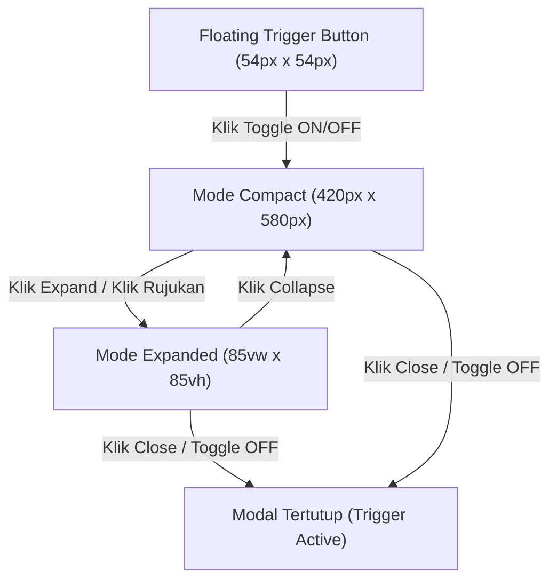

# LAPORAN PERANCANGAN DAN IMPLEMENTASI ANTARMUKA (UI/UX)
## SISTEM CHATBOT ASISTEN AKADEMIK UNIVERSITAS SAM RATULANGI

---

### 1. RINGKASAN EKSEKUTIF

Sistem Asisten Akademik UNSRAT dirancang sebagai **antarmuka berbasis widget interaktif yang terintegrasi secara langsung (*native embedded widget*)** pada portal resmi Universitas Sam Ratulangi (`/`). Konsep antarmuka ini mengusung pendekatan *Modern Academic Editorial Layout* yang responsif, minimalis, dan intuitif, sehingga pengguna (mahasiswa, dosen, dan sivitas akademika) dapat melakukan interaksi tanya jawab seputar peraturan akademik kampus tanpa meninggalkan konteks portal utama.

---

### 2. IDENTITAS VISUAL DAN AESTHETICS DESIGN (DESIGN TOKENS)

Seluruh komponen antarmuka dibangun menggunakan identitas visual resmi Universitas Sam Ratulangi dengan prinsip *Pure Scoped Vanilla CSS* (namespace `.rag-*`) untuk menjamin **100% isolasi gaya visual** tanpa konflik style dari portal induk.

#### Tabel Token Warna Resmi:
| Token Desain | Kode Warna (Hex) / Value | Penggunaan Utama |
| :--- | :--- | :--- |
| **Primary Maroon** | `#7B2D2D` | Header modal, bubble pesan pengguna, tombol aksi utama, dan aksen judul. |
| **Primary Hover** | `#963E3E` | State hover pada tombol dan elemen interaktif. |
| **Primary Pressed** | `#5C1F1F` | State aktif/ditekan (*active state*) pada tombol. |
| **Netral Hangat (Canvas)** | `#FAF9F6` | Latar belakang kontainer rujukan, area pesan asisten, dan form input. |
| **Netral Border** | `#E4DFD9` | Garis pemisah (*hairline border*) antar-section dan outline box rujukan. |
| **Pill Badge Background** | `rgba(123, 45, 45, 0.08)` | Latar belakang badge nomor rujukan dan label aksen. |

---

### 3. ARSITEKTUR KELAKUAN INTERAKSI DUAL-MODE

Antarmuka chatbot mendukung fleksibilitas visual melalui dua mode ukuran utama yang dapat beralih secara mulus (*smooth CSS transition*):

1. **Floating Trigger Button (Sakelar ON/OFF)**:
   * Tombol melayang berukuran **`54px x 54px`** yang diposisikan secara presisi di sudut kanan bawah (`right: 36px; bottom: 28px;`).
   * Berfungsi sebagai sakelar dua arah (*dual-action switch*) untuk membuka dan menutup modal secara langsung.

2. **Mode Compact (Default State)**:
   * Berukuran **`420px x 580px`** yang melayang di atas portal utama dengan batas *breathing room* `right: 36px; bottom: 96px;`.
   * Dirancang untuk pertanyaan cepat tanpa menghalangi pandangan pengguna terhadap konten halaman utama.

3. **Mode Expanded (Side-by-Side View)**:
   * Berukuran **`85vw x 85vh`** yang berposisi di tengah layar.
   * Mengaktifkan tampilan berdampingan (*side-by-side layout*) antara percakapan utama dengan **Tab Panel Rujukan Dokumen**, memfasilitasi pembacaan dokumen peraturan yang panjang dan komprehensif.

---

### 4. KOMPONEN UTAMA ANTARMUKA

#### A. Layar Sambutan (*Welcome State*)
* **Header Sambutan**: Menampilkan Logo Resmi UNSRAT berukuran **`72px x 72px`** dengan efek bayangan halus (*drop-shadow*), judul *"SELAMAT DATANG"*, dan deskripsi petunjuk layanan.
* **Chip Rekomendasi Pertanyaan**: 5 pilihan pertanyaan rekomendasi dengan ukuran *text-fit compact* (`width: fit-content`) yang secara otomatis mengeksekusi pencarian saat diklik.

#### B. Kanvas Percakapan (*Academic Chat Canvas*)
* **Bubble Pesan Pengguna**: Menggunakan warna Primary Maroon (`#7B2D2D`) dengan ekor percakapan di **Kanan-Atas** (`border-radius: 18px 4px 18px 18px`) dan header timestamp `Anda • HH:MM` yang sejajar di atas bubble.
* **Jawaban Asisten Akademik**: Ditampilkan di atas kanvas transparan tanpa kotak (*unboxed text*), dipadukan dengan tipografi tajam bertingkat (`line-height: 1.68`) untuk memberikan kenyamanan membaca ala dokumen akademik.
* **Header Modal**: Memuat judul *"Asisten Akademik UNSRAT"*, serta tombol aksi minimalis (*Settings*, *Reset*, *Expand*, *Close*) yang bebas dari atribut tooltip bawaan browser untuk estetika yang lebih bersih.

#### C. Tab Panel Rujukan Dokumen Akademik (*Academic Editorial Citation Panel*)
* **Borderless Document Flow**: Menghapus bingkai luar berlapis (*zero box-in-box fatigue*) sehingga panel rujukan terasa menyatu dengan modal.
* **Outlined Snippet Box**: Kontainer teks kutipan (*chunk*) menggunakan latar putih (`#ffffff`), garis outline `1px solid #E4DFD9`, dan sudut melengkung `12px`.
* **Preservasi Format Baris (*Line-Break Fidelity*)**: Menggunakan properti `white-space: pre-wrap` untuk mempertahankan potongan baris asli, penomoran pasal/ayat `(1)`, `(2)`, `(3)`, dan format paragraf dari dokumen peraturan kampus.
* **Breadcrumb Metadata Hirarkis**: Menampilkan hirarki lengkap struktur dokumen secara horizontal, contoh:  
  **`BAB XII — PENYELENGGARAAN PENDIDIKAN • Bagian Kelima — CUTI AKADEMIK • Pasal 49`**

---

### 5. MANAJEMEN STATE DAN ENGINE TEKNIS

1. **Encapsulated State Machine**:
   * Mengelola kondisi antarmuka secara terpusat melalui variabel state: `status` (`idle` | `streaming`) dan `mode` (`compact` | `expanded`).
2. **Textarea Auto-Grow**:
   * Input teks menggunakan `<textarea>` yang dapat menyesuaikan tinggi secara otomatis (`min-height: 38px`, `max-height: 120px`), mendukung tombol `Enter` untuk mengirim pesan dan `Shift + Enter` untuk baris baru.
3. **Pemberhentian Stream (*Abort Streaming*)**:
   * Pengguna dapat menghentikan pencarian di tengah jalan. Teks yang sudah ter-generate tetap dipertahankan dan dilengkapi dengan *badge* notifikasi amber yang informatif.

### 📊 Ringkasan Statistik Perubahan

  • Total Commit: 20 Commits di atas branch main
  • File Terpengaruh: 11 Files
  • Perubahan Baris: +3,695 Insertions, -24 Deletions
  ──────
  ### 📂 Rincian Perubahan per Berkas (File-by-File Diff Breakdown)

     PRODUCT.md                                         |   50 +-
     UI-UX-SPEC-MODAL.md                                |  158 +++
     app.py                                             |   38 +-
     .../plans/2026-08-10-unsrat-demo-modal-uiux.md     | 1312 ++++++++++++++++++++
     .../2026-08-10-unsrat-demo-modal-uiux-design.md    |  126 ++
     static/demo/assets/.gitkeep                        |    1 +
     static/demo/css/demo-modal.css                     |  820 ++++++++++++
     static/demo/evaluation.html                        |  233 ++++
     static/demo/index.html                             |  173 +++
     static/demo/js/chat-widget.js                      |  539 ++++++++
     static/demo/js/eval-standalone.js                  |  269 ++++
     11 files changed, 3695 insertions(+), 24 deletions(-)
    ──────
  ### 🔍 Analisis Perubahan Komponen Utama

  #### 1. Frontend Core UI/UX (static/demo/)

  • static/demo/css/demo-modal.css (+820 baris):
      • Mengusung Pure Scoped Vanilla CSS (.rag-*) yang 100% aman dari bentrok dengan CSS WordPress homepage maupun Tailwind.
      • Implementasi Mode Compact (width: 420px; height: 580px; right: 36px; bottom: 96px;) dan Mode Expanded (width: 85vw; height: 85vh;).
      • Floating Trigger Button (54px x 54px; right: 36px; bottom: 28px;) dengan efek melayang modern.
      • Styling Academic Editorial Citation Panel: Outlined snippet box (#ffffff + 1px solid #E4DFD9), borderless outer item flow, dan breadcrumbs metadata.
      • Ekor bubble chat user Kanan-Atas (border-radius: 18px 4px 18px 18px;) dan penyesuaian timestamp header terpisah.
  • static/demo/js/chat-widget.js (+539 baris):
      • Engine State Machine (idle, streaming, compact, expanded).
      • Sakelar ON/OFF dua arah pada tombol trigger melayang.
      • Penanganan streaming SSE /api/chat dengan parser Markdown & sanitasi warning abort.
      • Kepatuhan DRY: Caching template HTML welcomeStateHTML dari DOM saat inisialisasi untuk mengeliminasi duplikasi template string di resetChat().
      • Header modal dengan tombol ikon SVG Lucide 100% tanpa emoji, floating context menu settings dropdown, dan textarea auto-grow.
      • Sanitasi atribut tooltip hover (stripButtonTitles()).
  • static/demo/index.html (+173 baris):
      • Replika homepage official UNSRAT dengan injeksi widget #rag-chatbot-widget.
  • static/demo/evaluation.html (+233 baris) & eval-standalone.js (+269 baris):
      • Halaman dashboard evaluasi RAGAS standalone tanpa sidebar.

  #### 2. Backend & Routing (app.py) (+38 / -24 baris)

  • Pengalihan route utama / ke halaman demo frontend UNSRAT (static/demo/index.html).
  • Penambahan endpoint /evaluation dan /testing.
  • Penyesuaian streaming SSE /api/chat yang terintegrasi dengan pipeline RAG backend.

  #### 3. Spesifikasi & Dokumentasi Perancangan (+1,646 baris)

  • UI-UX-SPEC-MODAL.md: Spesifikasi desain UI/UX modal.
  • docs/superpowers/plans/*: Dokumen perencanaan teknis, arsitektur data, dan langkah-langkah implementasi.
  • PRODUCT.md: Pembaruan dokumentasi produk akhir.
  ──────
  ### 📝 Riwayat Commit Lengkap (Branch feature/unsrat-demo-frontend)

  1. 307bbac — refactor(demo): perbaiki UI/UX tab rujukan, pemulihan metadata Bab/Bagian/Pasal, dan pembersihan DRY
  2. 58f05c0 — refactor(demo): perbaiki UI/UX modal, posisi compact 36px, ekor bubble user, dan pembersihan DRY
  3. a4ac1fa — fix(demo): perbaiki font Inter, hilangkan scrollbar ganda, floating dropdown settings, dan SVG icons
  4. 972c9b9 — refactor(demo): iterasi mendalam pembersihan kode CSS, JS, dan HTML modal chatbot
  5. 175b396 — docs(spec): tambah dokumen UI-UX-SPEC-MODAL.md ke repository
  6. af5af86 — feat(demo): refaktor chat-widget.js dengan state machine, auto-submit chips, abort warning, dan auto-grow textarea
  7. aad2b66 — feat(demo): perbarui struktur HTML modal dengan logo UNSRAT, Lucide icons, dan textarea
  8. 0a10c75 — style(demo): perbarui CSS scoped demo-modal.css untuk mode compact/expanded dan citation panel
  9. ae4a06b — docs(plan): tambah rencana kerja implementasi UI/UX modal chatbot UNSRAT
  10. fb46ab1 — docs(spec): tambah dokumen perancangan UI/UX modal chatbot UNSRAT final
  11. 278b880 — fix(demo): hapus topbar header /evaluation & aktifkan accordion rujukan dokumen di chatbot modal
  12. a705a01 — feat(demo): samakan tampilan halaman /evaluation dgn tab evaluasi RAGAS tanpa sidebar
  13. 6da36a8 — fix(demo): hilangkan tailwind cdn untuk presisi layout, rapikan kode modal minimal, dan perbaiki blinking stream
  14. b321dfc — fix(demo): perbaiki posisi tag script/widget dan payload API chat
  15. 227c6a0 — feat(demo): implementasi halaman evaluasi standalone
  16. bbe2408 — feat(demo): ekstraksi chat-widget.js dari app.js
  17. 4bc5bac — style(demo): styling modal dan scoping tailwind
  18. 21e8737 — feat(demo): tambah homepage replika unsrat dengan tombol trigger dan kerangka modal
  19. 02725c2 — feat(routing): tambah route /testing dan /evaluation, alihkan / ke demo
  20. 356ffb7 — chore: setup folder structure static/demo