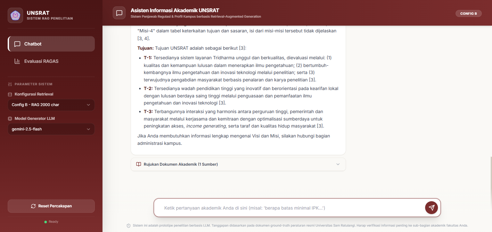
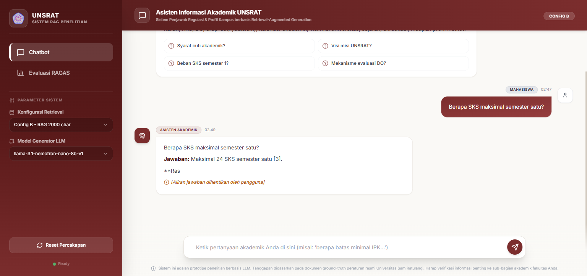

# 📝 Walkthrough Sesi Pengujian Fitur Abort & Watchdog Timer (3 Juni 2026)

Dokumen ini mendokumentasikan hasil pengujian fungsionalitas penghentian manual (manual abort) oleh pengguna dan penghapusan client-side watchdog timer pada sistem **UNSRAT RAG Chatbot v4**.

Sesi pengujian dilakukan menggunakan Playwright untuk memvalidasi interaksi UI/UX dan perilaku server backend dalam dua skenario utama.

---

## 🔍 Skenario Uji 1: Normal Completion Check
Skenario ini memvalidasi bahwa ketika respons stream selesai secara alami (tanpa interupsi pengguna), tidak ada catatan kaki peringatan (abort footnote) yang ditampilkan, dan status aplikasi kembali ke keadaan siap (`Ready`).

### Detail Perilaku:
1. Pengguna mengirimkan kueri ke sistem.
2. Server backend memproses kueri, melakukan retrieval dokumen, dan menghasilkan teks respons via Server-Sent Events (SSE).
3. UI menampilkan teks respons secara bertahap (streaming) dan status berubah menjadi `Thinking / Streaming...`.
4. Setelah stream selesai secara normal (server mengirim event `[DONE]`), tombol *Stop* kembali menjadi tombol *Send*, status aplikasi kembali ke `Ready`, dan tidak ada teks peringatan tambahan pada respons.

### Bukti Pengujian:
Screenshot di bawah menunjukkan penyelesaian normal tanpa adanya catatan kaki abort:

---

## 🔍 Skenario Uji 2: Manual Abort Check
Skenario ini memvalidasi perilaku sistem ketika pengguna menekan tombol *Stop* secara manual sebelum generator selesai mengirimkan seluruh respons.

### Detail Perilaku:
1. Pengguna mengirimkan kueri dan server mulai mengirimkan token respons.
2. Pengguna mengklik tombol **Stop** pada UI.
3. Client-side controller langsung memanggil fungsi `abort()` pada object `AbortController`.
4. Koneksi HTTP SSE ditutup seketika secara bersih.
5. Teks respons yang sudah sempat diterima hingga token terakhir sebelum penghentian tetap dipertahankan di dalam chat area.
6. Catatan kaki peringatan ditambahkan di bagian bawah pesan: 
   `⚠️ [Pencarian dihentikan oleh pengguna. Informasi di atas mungkin tidak lengkap.]`
7. Aplikasi segera mengembalikan state ke `Ready` (tombol berubah kembali ke *Send* dan input box diaktifkan kembali).
8. Flag `isUserAborted` digunakan untuk memastikan peringatan ini hanya muncul pada manual abort, dan tidak pada normal completion atau gangguan koneksi lainnya.

### Bukti Pengujian:
Screenshot di bawah menunjukkan respons yang terhenti di tengah jalan dengan catatan kaki peringatan abort ditambahkan di akhir pesan:

